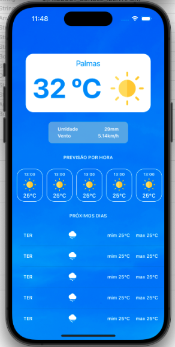

# Weather App iOS 🌤️

Aplicativo iOS em Swift que consome a API do **OpenWeatherMap** para exibir previsões do tempo em tempo real. A interface é totalmente desenvolvida via **View Code**, sem o uso de Interface Builder ou Storyboards.

---

## 📱 Tecnologias e Arquitetura

- **Linguagem**: Swift  
- **Plataforma**: iOS (suporte conforme target do projeto)  
- **Interface**: programática através de **View Code**  
- **Layouts**:  
  - `UIStackView` para organização de elementos  
  - `UITableView` para exibição de informações sequenciais (ex.: previsão horária)  
  - Componentes visuais: `UILabel`, `UIImageView`, `UIView`  
  - Estilização com `UIColor`  
- **Código organizado via Extensions** para facilitar manutenção e reutilização  
- **Models**: structs que mapeiam o JSON da API

---

## 🐞 EXPLICANDO PROBLEMA

Devido à versão completa da API do OpenWeatherMap ser paga, utilizamos uma versão anterior e gratuita da API.  
Por esse motivo, os dados disponíveis atualmente são limitados à:

- Temperatura atual  
- Umidade relativa do ar  
- Velocidade do vento  

Funcionalidades como previsão horária ou diária detalhada estão indisponíveis nessa versão gratuita.  
Caso deseje expandir os recursos, recomenda-se obter uma chave da [versão completa da API](https://openweathermap.org/api).

## 🌐 Integração com API

A chamada à API é feita através da URL base:

`private let baseURL: String = "https://api.openweathermap.org/data/2.5/weather"`

**Fluxo de integração**:

1. Usuário insere ou seleciona uma cidade  
2. `WeatherService` monta a URL com `baseURL`, parâmetros e **API Key**  
3. Requisição HTTP é enviada e **JSON** é recebido  
4. `JSONDecoder` converte o JSON em `structs`  
5. Interface é atualizada com os dados obtidos

---

## 🗂 Estrutura do Projeto

```
Weather_App_iOS/
├── AppDelegate.swift
├── SceneDelegate.swift
├── Services/
│   └── WeatherService.swift
├── Extensions/
│   ├── Color+Extensions.swift
├── Views/
│   ├── DailyForecastTableViewCell.swift
│   ├── HourlyForecastCollectionViewCell.swift
├── Controllers/
│   └── ViewController.swift
└── Resources/
    └── Assets.xcassets
```

- **Models**: structs que representam as respostas JSON (temperatura, clima, ícone etc.)  
- **Services**: `WeatherService` cuida da conexão com a API e modelagem de dados  
- **Extensions**:  
  - `Color+Extensions.swift`: paleta de cores do app  
- **Views**: componentes visuais criados via View Code  
- **Controllers**: lógica de interface e interação com o usuário

---

## ⚙️ Como Rodar

1. Clone o repositório:

```bash
git clone https://github.com/bersoncrios/Weather_App_iOS.git
cd Weather_App_iOS
```

2. Abra `Weather_App_iOS.xcodeproj` com Xcode 13 ou superior  
3. Obtenha uma API Key no [OpenWeatherMap](https://openweathermap.org/api)  
4. Insira sua chave em `WeatherService.swift`:

```swift
private let apiKey = "SUA_API_KEY_AQUI"
```

5. Rode o projeto selecionando simulador ou dispositivo (⌘R)

---

## 🧩 Funcionalidades

- Busca por cidade e exibição imediata do clima  
- Exibição de temperatura, descrição, e ícone climáticos  
- Lista de previsões (horária ou diária) via `UITableView`  
- Layout responsivo com Stack Views e constraints programáticas

---

## 🧪 Possíveis Melhorias

- Modo **Dark Mode**  
- Cache local com SQLite/CoreData para uso offline  
- Suporte a geolocalização  
- Testes automatizados (Unit & UI Tests)  
- Internacionalização / Localização (i18n + l10n)

---

## 🛡️ Licença

Distribuído sob a licença **MIT**. Veja o arquivo `LICENSE` para detalhes.

---

## 🤝 Contribuições

Contribuições são bem-vindas! Se quiser ajudar:

1. Abra uma **issue** descrevendo sua sugestão  
2. Envie um **Pull Request** com melhorias

---

## 🖼️ Capturas de Tela

### ☁️ Tela com Resultado do Clima


